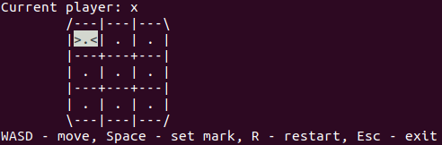
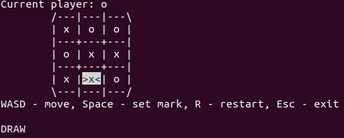

# TicTackToe

## Установка
Используйте **make**, чтобы скомпилировать программу или сделайте это вручную (например, gcc -o ticTackToe -I include src/main.cpp src/TicTackToe.cpp -lstdc++)

## Использование
Запустите программу **./tickTackToe**  
Для корректной работы в терминале должно быть достаточно места и он должен быть очищен (команда **clear**)  
Используйте: **WASD** для перемещения по игровому полю, **SPACE** для установки отметки, **R** для перезапуска, **Esc** - для выхода

## Скриншоты

